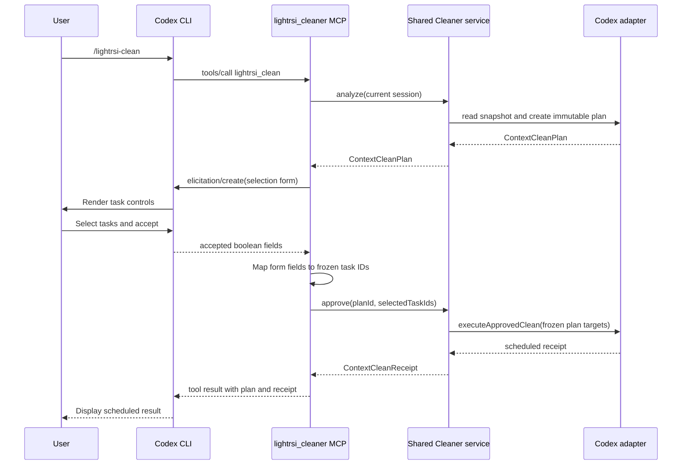

# Codex Cleaner MCP Elicitation Architecture

## Goal

Allow `/lightrsi-clean` inside the Codex CLI to display a host-rendered task
selection form, accept keyboard selection, and schedule the exact selected
Cleaner tasks without asking the model to copy plan or task IDs.

The existing direct command remains supported:

```text
lightrsi codex clean
```

Its raw-TTY prompt continues to live in `components/products/cli/src/clean-prompt.ts`.

## Decision

Add a Codex-specific `lightrsi_cleaner` MCP server alongside the existing
`tokenpilot_memory_fault_recover` server. Do not extend or rename the recovery
server in the first release. This keeps the new interaction path isolated and
avoids changing the recovery tool's installation and approval identity.

The Codex Cleaner MCP tool performs analysis, elicitation, selection mapping,
validation, and scheduling in one tool call:



Keeping analysis and approval inside one MCP call avoids a model-generated
`--plan/--select` command and avoids an intervening Host turn between the plan
and selection.

## Package boundaries

### `@lightrsi/cleaner`

Owns Host-neutral Cleaner control operations. Add a service that contains the
business behavior currently embedded in the CLI backend:

```ts
export interface ContextCleanerControlService {
  analyze(sessionId: string): Promise<ContextCleanPlan>;
  readPlan(planId: string): Promise<ContextCleanPlan | undefined>;
  approve(planId: string, selectedTaskIds: readonly string[]): Promise<ContextCleanReceipt>;
  readReceipt(planId: string): Promise<ContextCleanReceipt | undefined>;
  cancel(planId: string): Promise<ContextCleanReceipt>;
}

export function createContextCleanerControlService(params: {
  stateDir: string;
  bridge: ContextCleanerHostBridge;
  recommendationProvider?: ContextCleanRecommendationProvider;
  contextWindowTokens?: number;
  now?: () => string;
}): ContextCleanerControlService;
```

This service recovers item IDs and digests from the stored immutable plan. It
never accepts those lower-level identifiers from MCP input.

### `@lightrsi/cli`

Remains a presentation and argument-parsing layer. Its `CleanCommandBackend`
becomes a thin view adapter over `ContextCleanerControlService`.

`clean-prompt.ts` remains unchanged. Direct terminal users retain the existing
up/down, space, Enter, and `y/N` interaction.

### `@lightrsi/mcp`

Add a reusable full-duplex stdio session. The current server only responds to
client requests; elicitation also requires the server to send a request and
later correlate the client's response.

```ts
export interface McpServerPeer {
  readonly clientCapabilities: McpClientCapabilities;
  request<T>(method: string, params: Record<string, unknown>): Promise<T>;
}

export interface McpToolHandler {
  definition: McpToolDefinition;
  call(args: Record<string, unknown>, peer: McpServerPeer): Promise<McpToolResult>;
}

export function serveStdioMcpServer(params: {
  serverInfo: { name: string; version: string };
  tools: readonly McpToolHandler[];
}): Promise<void>;
```

The peer owns request IDs, pending response promises, capability negotiation,
notifications, and both newline-JSON and Content-Length framing. The existing
recovery server keeps its current behavior during this release.

### `@lightrsi/codex-adapter`

Owns the Codex session resolver, Cleaner service composition, elicitation
schema, and the new server entry point.

```text
components/adapters/codex/src/context-cleaner/control-service.ts
components/adapters/codex/src/context-cleaner/mcp-selection.ts
components/adapters/codex/src/cleaner-mcp-server.ts
```

`control-service.ts` loads Codex configuration, resolves the current session
using `CODEX_SESSION_ID`, then `CODEX_THREAD_ID`, then the existing latest-session
fallback, and creates the shared Cleaner service.

`mcp-selection.ts` exposes one tool:

```ts
export const CODEX_CLEANER_MCP_SERVER_NAME = "lightrsi_cleaner";
export const CODEX_CLEAN_TOOL_NAME = "lightrsi_clean";
```

The tool has no task-ID input. An optional explicit session-ID input is also
excluded from the first release; the existing Codex session resolver is the
single source of session identity.

## Elicitation contract

Only selectable tasks become form fields. Protected tasks remain visible in
the plan summary but cannot be returned as selected values.

```ts
{
  mode: "form",
  message: renderCodexCleanPlanForElicitation(plan),
  requestedSchema: {
    type: "object",
    properties: {
      task_1: {
        type: "boolean",
        title: "OAuth refresh regression",
        description: "<exact task ID> · <size> · <recommendation>",
        default: false
      }
    },
    required: ["task_1"]
  }
}
```

The field names are generated ordinals. A server-local map freezes
`task_1 -> exact taskId` for the lifetime of that request. The model never
constructs or repairs an ID.

Elicitation outcomes:

| Outcome | Behavior |
| --- | --- |
| Accept with selected tasks | Re-read and validate the stored plan, then schedule exactly those tasks. |
| Accept with no tasks | Return `No tasks selected`; do not schedule. |
| Decline or cancel | Return `Context clean cancelled`; do not schedule. |
| No selectable tasks | Return the analysis and skip elicitation. |
| Missing form capability | Return a structured compatibility error and the direct CLI fallback command. |
| Plan conflict or stale plan | Return the existing Cleaner error; never regenerate or substitute IDs automatically. |

Form acceptance is the explicit task confirmation. No task is selected by
default. The MCP tool definition must accurately declare that it can schedule
a later context rewrite; installation must not silently grant permanent tool
approval.

## Installation and skill routing

The Codex build adds `cleaner-mcp-server` as an esbuild entry point. Release
packaging copies that artifact without replacing the existing recovery MCP
artifact.

The installer writes two independent MCP blocks:

```toml
[mcp_servers.tokenpilot_memory_fault_recover]
# Existing recovery MCP configuration

[mcp_servers.lightrsi_cleaner]
command = "<node>"
args = ["<adapter>/dist/cleaner-mcp-server.js"]
startup_timeout_sec = 90

[mcp_servers.lightrsi_cleaner.env]
TOKENPILOT_STATE_DIR = "<configured stateDir>"
```

For Codex only, the generated `lightrsi-clean` skill calls
`lightrsi_cleaner.lightrsi_clean` exactly once. Claude Code keeps the current
shell-based, analysis-only skill until its own elicitation compatibility work.

The existing commands remain available as compatibility and recovery paths:

```text
lightrsi codex clean
lightrsi codex clean --plan <plan-id> --select <task-ids>
lightrsi codex clean --status <plan-id>
lightrsi codex clean --cancel <plan-id>
```

## Failure and lifecycle rules

- If analysis fails, no elicitation request is sent.
- If elicitation is cancelled, no approval or scheduling call runs.
- If the MCP process exits while elicitation is pending, pending promises reject
  and no receipt is written.
- Selection validation remains in the shared Cleaner service and the Host
  execution bridge; the UI schema is not a security boundary.
- Scheduling remains deferred to the next Host request, matching current
  Cleaner behavior.
- Status and cancellation continue to use the existing stored plan and receipt
  formats.

## Verification boundary

The Codex proof in `var/codex-elicitation-probe` has already confirmed that the
installed Codex CLI can render MCP form elicitation, accept keyboard input, and
return the exact checked booleans. Production verification must additionally
prove that the returned task IDs schedule only the frozen plan targets and that
the existing raw-TTY and non-TTY paths do not change.
