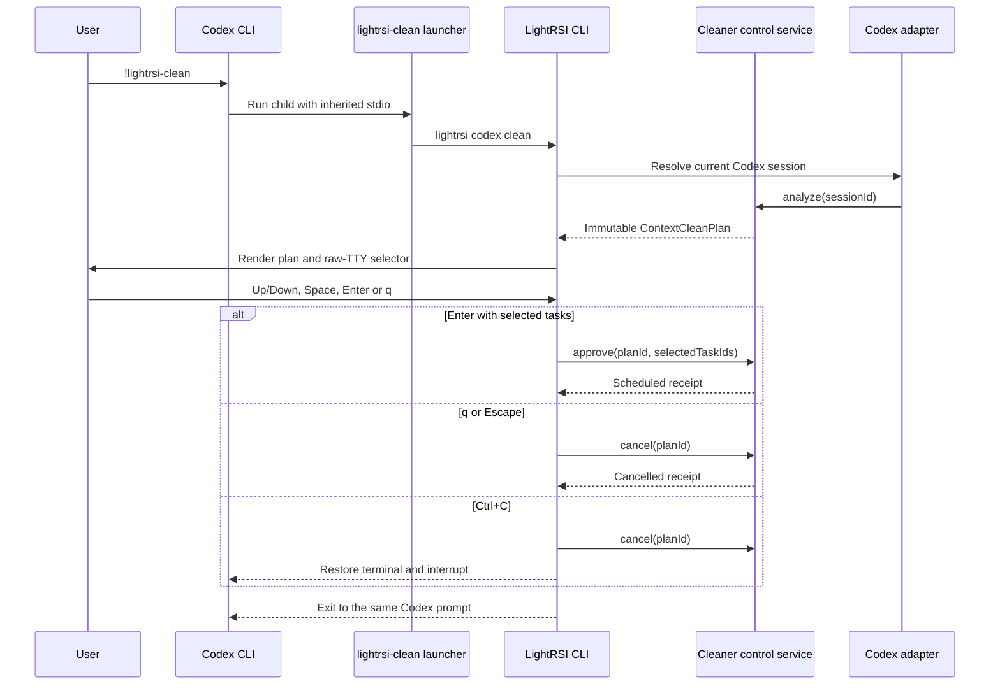

# Codex Cleaner Raw-TTY Selection Design

## Status

Approved direction: the primary Codex Cleaner interaction is invoked from the
Codex CLI with:

```text
!lightrsi-clean
```

The command runs in the current terminal, returns to the same Codex session,
and uses LightRSI's raw-TTY selector. The existing MCP elicitation form remains
available as a compatibility path, but it is not the target interface for this
feature.

## Goal

Give Codex CLI users a task selector with this exact keyboard contract:

- Up and Down move the cursor only among selectable tasks.
- Space toggles the task under the cursor.
- Enter submits the current selection immediately.
- `q` cancels the current Cleaner plan.
- Escape has the same cancellation behavior as `q`.
- Ctrl+C restores the terminal and schedules no cleanup.

The interaction must not open another terminal window, ask the model to copy a
plan ID, or require a second `y/N` confirmation.

## Scope

This change covers Codex first. It reuses the current Cleaner task registry,
plan store, recommendation logic, protected-task rules, approval validation,
receipt persistence, and deferred apply pipeline.

The change does not add the same launcher to Claude Code or OpenClaw, modify the
Codex CLI application itself, change task classification, or alter the stored
plan and receipt formats.

## Why a shell command is required

Codex owns the rendering and keybindings of MCP `elicitation/create` forms.
LightRSI can define boolean fields, but it cannot make the host use Up and Down
for task traversal, Space for toggling, Enter for direct submission, or `q` for
plan cancellation.

Codex's `!` shell escape gives a child process the current terminal. A
LightRSI-owned process can therefore enable raw mode, interpret individual key
presses, render the selector, restore terminal state, and return control to the
same Codex prompt. This keeps the requested interaction within the supported
extension boundary and avoids a fork of Codex.

## User-visible behavior

### Invocation

The documented Codex command is:

```text
!lightrsi-clean
```

`lightrsi-clean` is an installed executable wrapper for:

```text
lightrsi codex clean
```

All arguments are forwarded, so diagnostic commands remain possible outside
the interactive path:

```text
lightrsi-clean --help
lightrsi-clean --status <plan-id>
lightrsi-clean --cancel <plan-id>
```

### Selector

The full Cleaner plan is rendered once before the selector. Protected tasks are
shown in the plan with `[-]`, but they are absent from the cursor ring and
cannot be toggled. Selectable tasks start unchecked.

The selector footer always describes the active keys:

```text
Up/Down move  Space toggle  Enter submit  q cancel
```

Enter returns the selected task IDs immediately. An empty selection schedules
nothing and prints `No tasks selected; no changes were applied.`

`q` or Escape calls `cancel(planId)`, persists the normal cancelled receipt,
and prints the rendered cancellation result. It must not merely dismiss the
prompt while leaving an analyzed plan without a receipt.

Ctrl+C restores input mode and cursor visibility, attempts to cancel the plan,
and exits the command as an interruption. No approval call or context rewrite
may be scheduled.

### Successful scheduling

For a non-empty selection, the existing control service re-reads the stored
immutable plan, validates the selected task IDs, schedules only the frozen
targets, and writes the scheduled receipt. The actual context rewrite remains
deferred until the next Codex host request.

## Architecture



### Command launcher

`components/adapters/shared/cli-bin-install.ts` gains a reusable fixed-command
alias installer. The Codex installer uses it to install `lightrsi-clean` with
fixed arguments `codex clean`; Claude Code does not call this installer in this
release.

On Unix-like systems the alias is an executable shell wrapper that uses `exec`
and forwards `"$@"`. On Windows it uses the repository's current ASCII `.cmd`
plus UTF-8-BOM PowerShell companion pattern. The PowerShell companion invokes
the configured Node executable, the built LightRSI CLI, the fixed arguments,
and `@args` without `Start-Process`. Standard input, standard output, standard
error, exit code, and TTY ownership remain attached to the calling terminal.

`installWindowsNodeCommandLauncher` accepts optional fixed arguments so quoting
and Unicode-path behavior stay centralized. Fixed arguments are emitted as
PowerShell string literals; user arguments continue through `@args`.

### Prompt result contract

`components/products/cli/src/clean-prompt.ts` returns an explicit result rather
than overloading `undefined`:

```ts
export type CleanTaskPromptResult =
  | { action: "submit"; selectedTaskIds: string[] }
  | { action: "cancel" }
  | { action: "interrupt" };

export type CleanTaskPrompt = (
  plan: CleanPlanView,
) => Promise<CleanTaskPromptResult>;
```

This lets the command layer distinguish an intentional empty submission from a
cancel request and an interrupt. The prompt owns only terminal rendering and
key interpretation; it does not call the backend.

The prompt cleanup routine is idempotent and always removes the keypress
listener, restores the previous raw-mode state, restores cursor visibility,
and pauses stdin. It runs before the promise resolves or rejects.

### Command orchestration

`components/products/cli/src/clean.ts` remains responsible for lifecycle
effects:

- `submit` with task IDs calls the existing approval path.
- `submit` with no task IDs schedules nothing.
- `cancel` calls `backend.cancel(plan.planId)` and renders that receipt.
- `interrupt` calls `backend.cancel(plan.planId)` and then throws
  `clean_selection_interrupted` so the CLI exits unsuccessfully.

This boundary keeps backend calls testable without simulating a real terminal
and prevents the UI layer from acquiring storage or Host dependencies.

### Session resolution

The launcher does not accept or construct a session ID. The existing Codex
host resolver remains the single source of session identity, preferring the
current Codex environment alias and then its existing configured/latest-session
fallback. The wrapper forwards the environment unchanged.

If no complete snapshot exists for the resolved session, the command returns
the existing `codex_clean_snapshot_incomplete` error and never opens the
selector. It must not silently target a different session.

### MCP compatibility path

The current `lightrsi_cleaner` MCP server, shared Cleaner control service, and
boolean elicitation mapping remain in place because they already provide exact
task-ID mapping and may be useful on hosts that prefer native forms.

Codex documentation and generated install guidance identify
`!lightrsi-clean` as the command for the raw-TTY experience. Invoking the MCP
skill may still show a Codex-owned form; it is not described as equivalent to
the raw-TTY selector.

## Failure handling

- Non-TTY input fails before analysis with `clean_interactive_tty_required` when
  the `lightrsi-clean` alias is used without status, cancel, help, or explicit
  non-interactive arguments. It does not fall back to an unselectable text
  plan.
- A launcher error preserves the child exit code.
- A rendering or keypress error restores raw mode and cursor visibility before
  returning the error.
- Approval and cancellation errors use the existing Cleaner error codes and do
  not regenerate a plan or substitute task IDs.
- A stale plan or receipt mismatch schedules nothing.
- Repeated Enter, `q`, or Ctrl+C events are ignored after the first terminal
  result is claimed.

## Installation and isolation

The normal Codex installer creates or refreshes the command alias beside the
existing `lightrsi` and `tokenpilot-codex` bins. Reinstallation is idempotent.
Doctor output reports whether the alias and its Windows companion exist.

Development and live verification run only from the existing isolated feature
worktree and temporary `CODEX_HOME`, `TOKENPILOT_STATE_DIR`, bin directory, and
workspace. Tests never invoke the installer against the user's normal home.
The live harness compares the normal Codex config hash before and after the run
and fails if it changes.

## Testing strategy

### Prompt unit tests

A fake TTY input/output harness drives keypress events and captures writes.
Tests cover cursor wraparound, protected-task exclusion, Space toggling, Enter
submission without `y/N`, empty submission, `q`, Escape, Ctrl+C, duplicate
terminal events, and raw-mode/cursor restoration on every exit.

### Command tests

Injected prompt results prove that submit calls approval exactly once, cancel
calls backend cancellation exactly once, interrupt cancels and returns an
error, and empty submit invokes neither approval nor cancellation.

### Launcher and installer tests

Temporary directories verify Unix and Windows launcher contents, fixed
argument order, user-argument forwarding, paths with spaces and non-ASCII
characters, exit-code propagation, inherited stdio, idempotent installation,
and Codex-only installation. Existing Claude installer assertions prove it is
unchanged.

### Regression tests

Run Cleaner package, CLI, Codex adapter, Claude adapter, package-boundary, and
type-check suites. The existing non-interactive `lightrsi codex clean` command,
explicit `--plan/--select`, status, cancel, MCP selection, and deferred apply
tests remain green.

### Isolated live test

The isolated test harness launches Codex with a temporary home and three short
tasks: A and B complete, C active and pending approval. After snapshots are
complete, the user runs `!lightrsi-clean`, selects A with Space, moves to B,
selects B, and presses Enter. The test passes when the scheduled receipt
contains exactly A and B, C remains protected, the next Host request applies
the rewrite, the same Codex session continues, and the normal Codex config hash
is unchanged.

A second run presses `q`. It passes when a cancelled receipt exists and no
rewrite is scheduled.

## Acceptance criteria

1. `!lightrsi-clean` opens the selector in the same Codex terminal without a
   new window.
2. Up and Down visit only selectable tasks and wrap at both ends.
3. Space toggles the focused task and updates the estimated release size.
4. Enter submits immediately; `Confirm clean? [y/N]` never appears.
5. `q` and Escape persist a cancelled receipt and schedule no rewrite.
6. Ctrl+C restores terminal state and schedules no rewrite.
7. Protected Task C cannot receive focus or enter the selected task IDs.
8. The receipt contains exactly the tasks selected from the immutable plan.
9. The next Codex request applies a scheduled rewrite and preserves protected
   context.
10. Claude Code, OpenClaw, normal Codex authentication, and the user's normal
    Codex configuration remain unchanged.

## Estimated implementation size

- Product code: 190 to 340 changed or added lines.
- Tests: 260 to 440 changed or added lines.
- Documentation and isolated-test updates: 80 to 150 lines.
- Total: approximately 530 to 930 lines across 10 to 15 files.
- Expected engineering time: 8 to 14 hours including Windows live debugging
  and regression verification.
