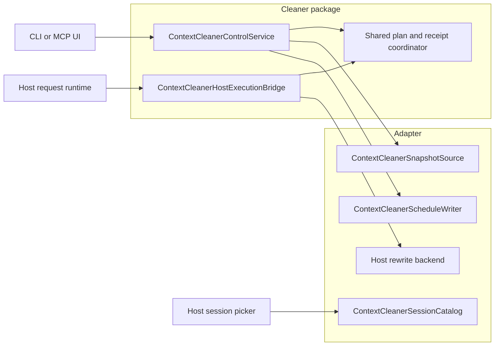

# Cleaner Host Interface Freeze Design

## Status

Review result: **ready to freeze only after the lifecycle fixes in this
document are implemented and verified**.

This specification supersedes the shared Cleaner interface, scheduling, and
cancellation lifecycle statements in:

- `docs/superpowers/specs/2026-09-01-codex-claude-cli-cleaner-design.md`
- `docs/design/codex-cleaner-elicitation.md`
- `docs/superpowers/specs/2026-09-13-codex-cleaner-raw-tty-design.md`

The Codex user-visible key contract in the raw-TTY design remains unchanged:
Up and Down move among selectable tasks, Space toggles, Enter submits, and `q`
or Escape cancels. This specification changes the host integration boundary
behind that interaction.

## Goal

Freeze one small, host-neutral Cleaner contract that Codex, Claude Code,
OpenClaw, and later adapters can implement independently without importing UI
logic or forwarding shared persistence methods back into the Cleaner package.

The frozen boundary must guarantee that:

- a shared `scheduled` receipt always has a durable host-local schedule;
- cancellation and host execution have one serialized winner;
- retries after a process crash are idempotent;
- callers branch on typed error codes instead of parsing `Error.message`;
- plan and receipt schema version 1 remains readable and unchanged;
- Codex terminal rendering can continue to change without changing adapters.

## Scope

This work covers the shared interfaces in `@lightrsi/cleaner`, the Codex and
Claude Code compositions that already use Cleaner, their host-local schedule
writers, the shared execution coordinator, and cross-host contract tests.

It also fixes the Codex MCP cancellation path so a displayed cancellation is
persisted through the same shared control service.

## Non-goals

- Do not implement Cleaner support in OpenClaw in this change.
- Do not change recommendation policy, attribution, task classification, or
  protected-task rules.
- Do not change the stored `ContextCleanPlan` or `ContextCleanReceipt` shapes,
  their schema version, or existing on-disk paths.
- Do not change the Codex raw-TTY selector, Windows console launcher, MCP form
  layout, or CLI text as part of the interface freeze.
- Do not modify Codex, Claude Code, or OpenClaw executables.
- Do not include VVEAI, Responses compatibility, WebSocket, model metadata, or
  unrelated transport work in the interface-freeze change.
- Do not run installers or live tests against the user's normal Codex home.

## Review of the current boundary

The current code has useful separation at the UI edge: the CLI prompt consumes
a host-neutral plan view, the Codex MCP form stays in the Codex adapter, and the
Windows raw-console option is enabled only by the Codex launcher. The execution
path also reconstructs frozen targets from the persisted plan before applying a
mutation.

Four parts are not safe to freeze yet.

### Shared `scheduled` state precedes the host schedule

`createContextCleanerControlPlane().executeApprovedClean(...)` currently writes
the shared `scheduled` state before the Codex or Claude bridge writes its
host-local schedule. A crash between those writes leaves a scheduled receipt
that no host request can consume.

### Cancellation does not compete with an execution claim

`prepareScheduledClean(...)` rechecks shared state and returns a mutation, but
does not atomically claim it. `cancelCleanPlan(...)` can then persist
`cancelled` while the host applies the already prepared mutation. The mutation
and receipt can disagree.

### The host bridge points in both directions

`ContextCleanerHostBridge` currently mixes snapshot reads, session listing,
host-local scheduling, shared receipt reads, and shared cancellation. Adapters
receive a `ContextCleanerControlPlane` only to forward its methods back into the
Cleaner package. This makes every new adapter depend on storage details that the
shared package already owns.

### Public failures are plain strings

The control service joins operation names and store reasons into
`Error.message`. UI and adapter code would need to parse those strings to
distinguish invalid input, a missing plan, a state conflict, and unavailable
storage.

## Dependency direction



The shared Cleaner service owns validation, plan and receipt persistence, and
lifecycle transitions. A host adapter supplies facts and effects: read a
snapshot, list sessions when a product needs discovery, durably write an inert
schedule pointer, and apply a validated mutation through its existing rewrite
runtime.

Adapters do not implement or forward `getPlan`, `getReceipt`, `cancel`, or
shared lifecycle transitions.

## Frozen public interfaces

All service methods use object parameters so later optional fields can be added
without positional overloads. Arrays exposed by the boundary are readonly.

### Host capabilities

```ts
export interface ContextCleanerSnapshotSource {
  readonly hostId: string;
  readSnapshot(input: {
    sessionId: string;
  }): Promise<ContextCleanSnapshot>;
}

export interface ContextCleanerSessionCatalog {
  listSessions(): Promise<readonly ContextCleanerSession[]>;
}

export type ContextCleanerScheduleWriteResult =
  | { outcome: "stored" }
  | { outcome: "unchanged" }
  | { outcome: "failed"; error: ContextCleanerError };

export interface ContextCleanerScheduleWriter {
  readonly hostId: string;
  writeSchedule(input: {
    planId: string;
    sessionId: string;
    baseRevision: string;
    selectedTaskIds: readonly string[];
    scheduledAt: string;
  }): Promise<ContextCleanerScheduleWriteResult>;
}
```

`writeSchedule` stores only a host-local pointer. It must not edit context. The
identity tuple is `hostId`, `planId`, `sessionId`, `baseRevision`, the
canonical selected task IDs, and `scheduledAt`. The shared service derives
`scheduledAt` from the durable approved receipt, so it remains identical across
retries. Repeating the same tuple returns `unchanged`; reusing the same plan ID
with different identity returns `failed` with `clean_state_conflict`.

`rewriteMode` remains adapter-internal because the shared Cleaner workflow does
not use it. Session discovery is separate because daemon and MCP compositions
often already know the active session and do not need a catalog.

### Shared control service

```ts
export interface ContextCleanerControlService {
  analyze(input: {
    sessionId: string;
  }): Promise<ContextCleanPlan>;

  getPlan(input: {
    planId: string;
  }): Promise<ContextCleanPlan | undefined>;

  scheduleSelection(input: {
    planId: string;
    selectedTaskIds: readonly string[];
  }): Promise<ContextCleanScheduledReceipt>;

  getReceipt(input: {
    planId: string;
  }): Promise<ContextCleanReceipt | undefined>;

  cancel(input: {
    planId: string;
  }): Promise<ContextCleanReceipt>;
}
```

`scheduleSelection` replaces the misleading `approve` name. A successful call
means both approval and durable scheduling completed. The service reconstructs
item IDs and digests from its immutable stored plan; callers and schedule
writers never supply them.

The service canonicalizes selected task IDs into their order in the stored
plan. Caller order never changes schedule identity, claim identity, receipt
identity, or host behavior.

An empty selection is invalid at this boundary. UI layers retain their current
behavior of returning without calling `scheduleSelection` when the user submits
no tasks.

### Host execution bridge

```ts
export type ContextCleanExecutionTerminalReceipt =
  | ContextCleanAppliedReceipt
  | (Omit<ContextCleanTerminalReceipt, "status"> & {
      status: "stale" | "failed";
    });

export type ContextCleanExecutionClaimResult =
  | {
      outcome: "ready";
      claimId: string;
      execution: ContextCleanPreparedExecution;
    }
  | {
      outcome: "terminal";
      receipt: ContextCleanAppliedReceipt | ContextCleanTerminalReceipt;
    }
  | { outcome: "missing" }
  | { outcome: "rejected"; error: ContextCleanerError };

export type ContextCleanTerminalRecordResult =
  | {
      outcome: "recorded" | "unchanged";
      receipt: ContextCleanExecutionTerminalReceipt;
    }
  | { outcome: "rejected"; error: ContextCleanerError };

export interface ContextCleanerHostExecutionBridge {
  readonly hostId: string;
  claimScheduledClean(
    input: ContextCleanExecutionRequest,
  ): Promise<ContextCleanExecutionClaimResult>;

  recordCleanReceipt(input: {
    claimId: string;
    receipt: ContextCleanExecutionTerminalReceipt;
  }): Promise<ContextCleanTerminalRecordResult>;
}
```

The execution bridge remains a shared implementation created by
`createContextCleanerHostExecutionBridge(...)`. Host runtimes consume it; host
adapters do not implement shared persistence.

## Typed error contract

```ts
export type ContextCleanerErrorCode =
  | "clean_invalid_input"
  | "clean_plan_not_found"
  | "clean_selection_duplicate_task"
  | "clean_selection_unknown_task"
  | "clean_selection_task_protected"
  | "clean_snapshot_unavailable"
  | "clean_schedule_write_failed"
  | "clean_state_conflict"
  | "clean_store_unavailable"
  | "clean_execution_in_progress"
  | "clean_execution_not_scheduled"
  | "clean_execution_stale";

export class ContextCleanerError extends Error {
  readonly code: ContextCleanerErrorCode;
  readonly details: Readonly<Record<string, unknown>>;
}
```

Service methods reject with `ContextCleanerError`. Discriminated host effects
return the same error type in their `failed` or `rejected` branch. The public
`details` object may contain IDs, statuses, or bounded reason codes, but never
native requests, transcript text, API keys, or adapter payloads.

Store-level `reasons: string[]`, transaction paths, and parser failures remain
internal diagnostics. UI layers render `error.code` and may log sanitized
`details`; they do not parse `message`.

## Scheduling lifecycle

Scheduling uses this order:

1. Read the immutable plan and validate the exact selected task IDs.
2. Under the per-plan lock, persist `analyzed -> approved`, or confirm an
   existing matching `approved` state.
3. Reuse the approved receipt's `updatedAt` as the stable `scheduledAt`, then
   call the host's idempotent `writeSchedule(...)` with plan identity and task
   IDs only.
4. Under the same per-plan lock, confirm the plan is still matching and persist
   `approved -> scheduled` with the timestamp passed to `writeSchedule`.
5. Return the stored scheduled receipt.

If step 3 fails, shared state remains `approved` and the caller receives
`clean_schedule_write_failed`. Retrying the same selection resumes at step 3.

If the process exits after step 3 but before step 4, the next identical call
reuses the approved timestamp, receives `unchanged` from the host writer, and
completes step 4. A host request that sees the pointer while shared state is
still `approved` treats it as deferred and leaves the pointer scheduled for a
later request. A pointer left behind by cancellation is reconciled to a
terminal cancelled host record without applying a mutation.

A different selection for an existing approved or scheduled plan returns
`clean_state_conflict`. It never overwrites the first approved selection.

## Execution claim and cancellation arbitration

Adding an `applying` receipt status would change the public stored schema. This
design instead uses an internal execution-claim sidecar at:

```text
<stateDir>/context-cleaner/execution-claims/<sha256(planId)>.json
```

The sidecar has its own internal schema version and stores only:

```ts
type ContextCleanExecutionClaimRecord = {
  schemaVersion: 1;
  claimId: string;
  planId: string;
  hostId: string;
  sessionId: string;
  baseRevision: string;
  selectedTaskIds: string[];
  scheduledReceiptUpdatedAt: string;
  status: "claimed" | "completed";
  createdAt: string;
  updatedAt: string;
};
```

`claimId` is deterministic from the stored plan identity, the selected task
IDs, and the scheduled receipt timestamp. It is not supplied by a UI or model.

After snapshot and protocol revalidation, `claimScheduledClean(...)` reacquires
the existing per-plan store lock. While holding the lock it re-reads the plan
and receipt, confirms `scheduled`, and atomically writes or reuses the matching
claim. Cancellation uses that same lock:

- if no claim exists, cancellation wins and writes `cancelled`;
- if a matching claim exists, execution wins and cancellation rejects with
  `clean_execution_in_progress`;
- if a terminal receipt exists, both operations return the terminal state
  idempotently;
- a conflicting claim rejects with `clean_state_conflict`.

A crash after claiming is recovered by the next host request. The same schedule
produces the same claim and mutation operation IDs. Host mutation application
must remain idempotent. Recording a terminal receipt requires the matching
claim ID and transitions the shared plan and receipt under the per-plan lock.
If the process exits after the terminal transition but before marking the
sidecar `completed`, recovery observes the terminal receipt and completes the
sidecar without reapplying the mutation.

## Revision policy

`ContextCleanPlan.snapshotItems` is an ordered metadata baseline used to freeze
selected targets, not a promise that every unrelated baseline item remains
unchanged.

When the revision changes, execution may relocate only the already approved
item IDs. Every selected item must retain its stored fingerprint, remain
removable, and pass lifecycle, protection, and tool-protocol closure checks.
Unrelated append or drift is allowed only when those selected-target checks
succeed. Relocation never adds a new item or task to the selection.

Legacy plans without `snapshotItems` remain executable only at their exact base
revision. A revision change makes them stale.

## Public and internal surfaces

The following are frozen for other adapter authors:

- `ContextCleanerSnapshotSource`
- `ContextCleanerScheduleWriter`
- `ContextCleanerSessionCatalog`
- `ContextCleanerControlService`
- `ContextCleanerHostExecutionBridge`
- their input and discriminated result types
- `ContextCleanerError` and `ContextCleanerErrorCode`
- existing plan, task, snapshot, and receipt data contracts

The following remain internal or experimental and must not be imported by new
adapters:

- `ContextCleanerControlPlane`
- raw plan, receipt, transaction, lock, and execution-claim stores
- `ContextCleanStoreWriteResult` and store reason arrays
- MCP framing, elicitation schema, and tool names
- CLI plan views, prompt state, rendering, and terminal key handling
- Windows command launchers and console helpers
- Codex and Claude native journals, schedule records, and rewrite payloads

`ContextCleanerControlPlane` is removed from public exports after existing
compositions migrate. No compatibility alias remains at merge time.

## Adapter author workflow

A new host adapter implements three independent capabilities as needed:

1. `ContextCleanerSnapshotSource` maps its canonical current context to stable
   metadata-only snapshot items.
2. `ContextCleanerScheduleWriter` writes an idempotent, inert pointer that its
   request runtime can discover.
3. `ContextCleanerSessionCatalog` lists sessions only when its product surface
   needs session discovery.

The host request runtime passes the pointer to the shared execution bridge,
applies only a returned `ready` execution through its existing rewrite backend,
and records the terminal receipt with the returned claim ID.

No adapter implements selection UI, recommendation policy, plan persistence,
receipt persistence, cancellation, or lifecycle transitions.

## Parallel development boundary

The shared lifecycle and interfaces in this specification land before new host
adapter work starts. After the freeze gate passes, ownership separates by path:

| Work lane | Owned surface | Must not change |
| --- | --- | --- |
| Shared Cleaner | `components/packages/features/cleaner` lifecycle, contracts, conformance rules | Host journals, terminal rendering, model transport |
| Codex interaction | Codex adapter Cleaner composition and `components/products/cli` selector/launcher behavior | Frozen Cleaner signatures and Claude/OpenClaw sources |
| Claude Code adapter | Claude snapshot, schedule writer, session catalog, and native runtime integration | Codex UI and shared lifecycle |
| OpenClaw adapter | OpenClaw snapshot, schedule writer, session catalog, and native runtime integration | Codex/Claude sources and shared lifecycle |

Codex rendering and key-handling fixes may continue after the freeze because
they consume `ContextCleanerControlService` and do not alter host capabilities.
Adapter authors can therefore work in parallel without rebasing for ordinary
Codex UI fixes.

After freeze, renaming or removing a frozen field or changing its semantics
requires a new versioned design. Backward-compatible optional capabilities may
be proposed separately; they are not added opportunistically during one host's
debugging.

## Compatibility and migration

The Cleaner package is still private beta, so source-level renames happen in one
coordinated change. Existing Codex and Claude code migrates before the old
bridge types are removed. Stored plan and receipt schema version 1 is preserved;
the new claim sidecar is independent and requires no data migration.

OpenClaw source is not changed. Its implementer can start from the frozen
adapter-author contract and the conformance helper after this work lands.

## Testing strategy

### Contract tests

A reusable conformance helper runs against a generic fake adapter and the Codex
and Claude Code implementations. It covers:

- analysis through a snapshot source;
- first and repeated scheduling of the same selection;
- conflicting and protected selections;
- host writer failure followed by retry;
- crash recovery between host pointer and shared scheduled state;
- cancellation before schedule completion;
- cancellation versus execution claim;
- claim replay after a simulated crash;
- terminal receipt replay;
- legacy plans without `snapshotItems`.

### Product regression tests

Codex MCP decline and cancel must call the shared `cancel(...)` method and return
the persisted receipt. CLI and raw-TTY tests prove that the current keyboard and
rendering behavior is unchanged.

### Isolation

Live Codex checks use a temporary `CODEX_HOME`, state directory, bin directory,
and workspace. Verification records the hashes of the user's normal
`~/.codex/config.toml` and `~/.codex/auth.json` before and after the run. No
installer targets the normal home.

## Acceptance criteria

- No shared `scheduled` receipt can exist without a matching durable host
  schedule.
- Retrying after either scheduling crash point converges to one scheduled
  receipt and one host pointer.
- Cancellation and execution claim cannot both succeed for the same plan.
- A host mutation cannot be recorded without the matching execution claim.
- Codex and Claude pass the same host-contract conformance suite.
- Codex MCP cancellation is reflected in the shared receipt store.
- The Codex raw-TTY keyboard behavior and output remain unchanged.
- OpenClaw has no source change and can implement only the frozen capabilities.
- Plan and receipt schema version 1 and their paths remain unchanged.
- Cleaner, CLI, Codex, Claude Code, and OpenClaw tests and typechecks pass, and
  package-boundary validation remains clean.
- The final interface-freeze diff contains no VVEAI, transport, model catalog,
  WebSocket, or test-environment configuration changes.
- The user's normal Codex configuration and authentication hashes are unchanged.

## Estimated change size

The expected implementation is moderate: approximately 350-500 production
lines for contracts, scheduling, typed errors, claim coordination, and adapter
migration; 650-900 test lines for races, recovery, and cross-host conformance;
and 100-180 documentation lines for the adapter author guide. The change should
be split into reviewable commits following the implementation plan rather than
combined with the existing Codex transport work.
